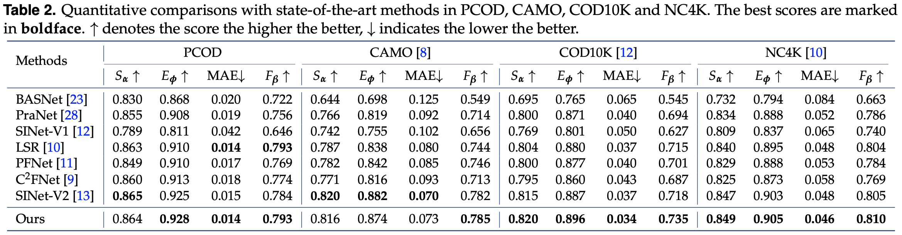

## Polarization-based Camouflaged Object Detection

------


This is the usage of part of our code. Training code and the remain part of PCOD dataset will be available soon.

## Requirements

To install the environment using Anaconda.

```shell
conda env create -f polarnet.yaml
```

## PCOD

-----

We train and test with a five-fold cross-validation in PCOD. The fold1 is available at [here](https://drive.google.com/drive/folders/1LiI89zAWrHl9rpb0yd4r7DVffKXsWn1b?usp=sharing). You can test on it with our pre-trained model. 


## Pre-trained Models

------

Overview of PolarNet:


The pre-trained model trained on the PCOD (trained on fold 2~5, and tested on fold1) is available at [here](https://drive.google.com/file/d/1INUvdrFsFwbjHj8TT-m5cbZHCLa868bC/view?usp=share_link), and the pre-trained model of our backbone is available at [here](https://drive.google.com/file/d/1Yt6KoHm28MYYNlNgM3os0kXGuTumpcq2/view?usp=share_link). You can load to evaluation on the fold1 set.

The pre-trained model trained on the [CAMO](https://sites.google.com/view/ltnghia/research/camo) and [COD10K](https://github.com/DengPingFan/SINet) is available at [here](https://drive.google.com/drive/folders/17p863g8IsSI0KPMwWqCuRYu5fAYYIo4A?usp=sharing). You can load to evaluation on the whole [NC4K](https://github.com/JingZhang617/COD-Rank-Localize-and-Segment) and the test sets of CAMO and COD10K.

## Testing

------

Before testing, set up the model path, the image and ground-truth path and the save path.

```python
parser = argparse.ArgumentParser()
parser.add_argument('--testsize', type=int, default=704, help='testing size')
parser.add_argument('--pth_path', type=str, default='./Snapshot/Polar-Net/the_trained_model.pth')
parser.add_argument('--save_path', type=str, default='./result/Polar-Net/the_save_path_file/')
opt = parser.parse_args()
...
os.makedirs(opt.save_path, exist_ok=True)
image_root = 'testing_image_path/'
gt_root = 'ground_truth_path/'
```

## Results

------

Quantitative and qualitative results in PCOD, CAMO, COD10K and NC4K are shown here:


